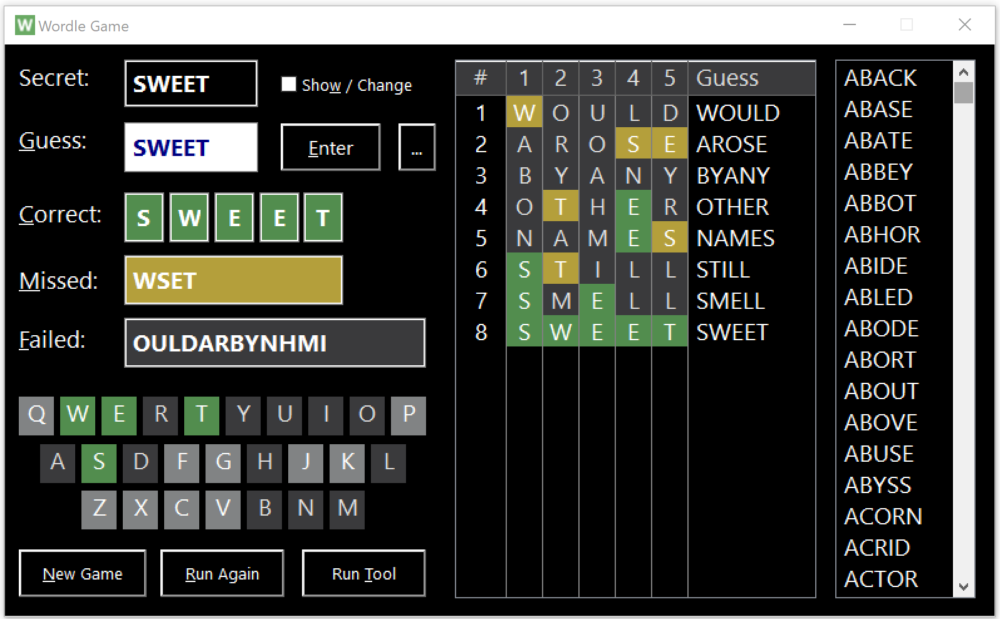
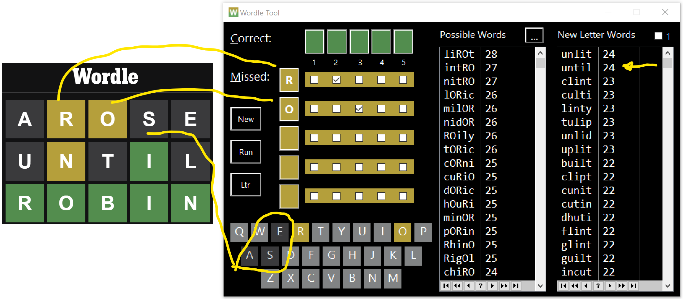
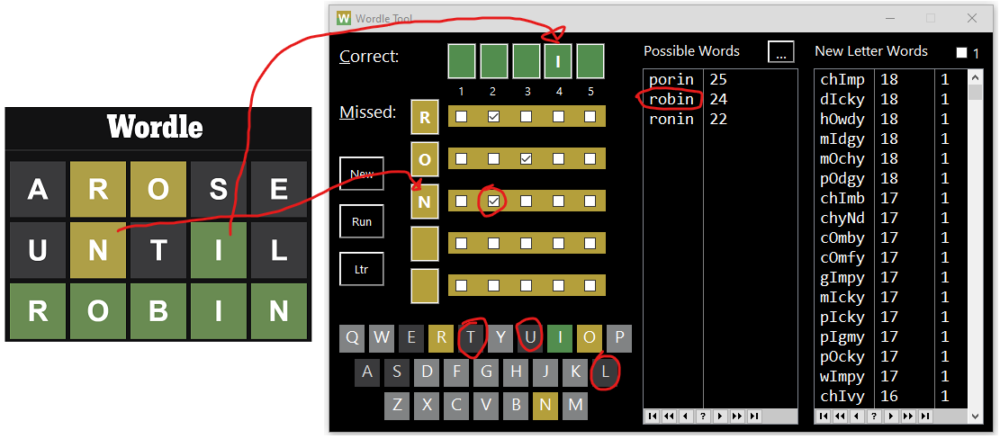
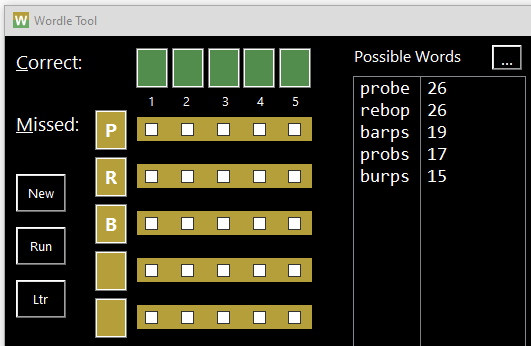
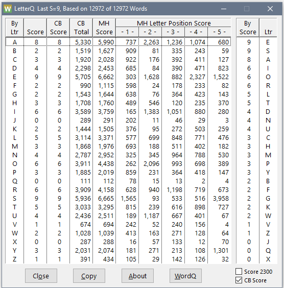
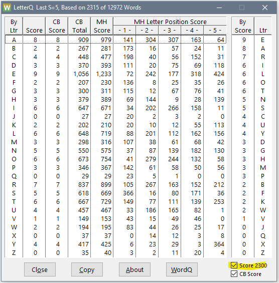
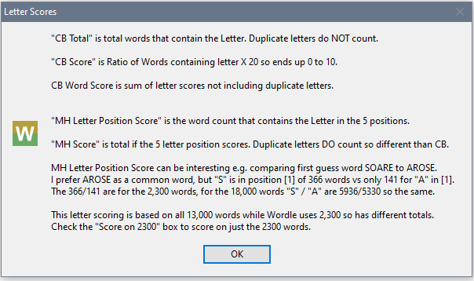

# Wordle

This repo contains Clarion source for a Wordle Game and Wordle Tool to help solve by suggesting words.

If you are not familiar with the
[online Wordle game](https://www.nytimes.com/games/wordle)
 you can read about [Wordle on Wikipedia](https://en.wikipedia.org/wiki/Wordle).

Using the Tool below makes it easy to always win, but it also helps you learn to play the game better.
 Combined with the Game you can learn even more by repeating games.

 ---

 ## Wordle Game

 The online Wordle game only allows a single puzzle per day.
  That made it hard to work on the solver tool code so I created my own version of the Wordle game written in Clarion.
  Mike's tool code provided many of the elements I needed.

  One good use for this game is after you play the game online you can enter the day's secret word into my game
   then use the solver tool below to see other words that you could have used to solve the puzzle.

 

 My game has a few differences from the online version:

  * You can Unhide the puzzle Secret Word at any time by clicking the "Show / Change" checkbox
  * Override the Secret Word (unhide first). Allows repeating games or testing certain words and letters.
  * Guess nonsense non-dictionary words by clicking Ignore on warning message e.g. BYANY
  * No limit of 6 guesses
  * Undo a guess by selecting it in the guess list then pressing the Delete key
  * [...] button shows list of suggested first words like: SOARE AROSE ARISE SLICE

---

## Wordle Tool

Mike Hanson created a Wordle Tool to help solve the puzzle by suggesting words.
He presented it on [ClarionLive 565](https://www.youtube.com/watch?v=K4lThuFXeAw)
 and published his Wordle [CwProj on the BoxSoft GitHub](https://github.com/BoxSoft/Wordle).

In this Repo you will find my modified version of Mike's Wordle tool.

 * Changed word dictonary to be actual 13,000 words used by the official game
 * Added a list of words containing only new letters that have not previously been guessed
 * Changed the scoring to be simpler and display the word score in the list
 * Added Button New that clears all letters for playing a new game
 * Added Button Run starts a new EXE
 * Added Button Ltr that displays a window with the letter scoring
 * Checkbox on Ltr window allows using just the 2300 game words. This makes it too easy to solve but does help you learn more about the game

To use this tool fill in the Correct Green letters in the Green entry boxes.
 Fill in the Yellow letters in the Yellow entry boxes then tick the check boxes for the positions 1-5 that missed.
 For any Gray letters that are not in the word you must click them in the keyboard at the bottom of the window.

In the Wordle game above the guess "AROSE" scores "R,O" as Yellow and "A,S,E" as Gray.
 In the Tool you enter the "R,O" into the Yellow entries and check boxes 2 and 3 to identify the position of the miss.
 For incorrect letters "A,S,E" you must click in the bottom keyboard to note those as Gray.
 The Tool then calculates the two word lists and scores.

The Tool suggests LIROT as the best word that contains R and O but not A,S,E.
By "best" the letters I,L,T are a bit more popular than I,N,T in INTRO or NITRO.
 I would use INTRO for my next guess because Wordle uses 2300 fairly common words.
  LIROT is ahhh "Turkish monetary unit" ?

On the far right of the Tool window the "New Letter Words" list has words that contain
 none of the "A,R,O,S,E" letters.
 I chose UNTIL for my next guess.
 The game scored "N" as Yellow, "I" as Green and "U,T,L" as Gray.
 In the Tool enter "N" in the Yellow entry and check box 2, enter "I" in the 4th Green entry and then click on "U,T,L" in the bottom keyboard.

 This narrows the possible list down to 3 with ROBIN being the word I guess and it is the correct answer.

 (_Note some consider it cheating to guess 5 new letters, you can tick the "1" box at the top-right of the list to require at least 1 found letter. It would be best if that was a Yellow letter so you take a shot at finding its correct position. The found letters show in upper case as seen in the word "`chImp`" below._)

If the 3 words possible (PORIN ROBIN RONIN) were all good choices you could use the Run button to start a new instance of the Tool.
 In that you could enter in the Yellow boxes the letters not in common of those words: P,R,B.
 That would provide a list of words so that with one more guess PROBE you could find the last 2 letters in the secret word; otherwise, it may take 3 guesses.
 In this case if a guess of ROBIN failed that would identify if "R" was in position 1 (making RONIN with word else it must be PORIN) so you could always solve this example in 2 guesses.
 Many times you will have 5+ possible words (e.g. STILL SHILL SPILL SKILL SWILL) that are more suited to this strategy.

---

## Letter Table

The [Ltr] button opens the below window that shows letter scoring stored in the LetterQ.
 The Tool scans the word dictionary and totals all the words that contain a letter.
 The CB scoring simply takes the percent of words with the letter (Total Words with Letter / Total Words) and multiplies by 20 to give a score of 0 to 9.
 E.g. "A" is in 5330 of 12972 words so 5330/12972 =  .410 x 20 = 8.2.
 You can see "E" and "S" are most popular scoring 9.
 It will probably help you to play better knowing what letters are nost popular, and to know to not use uncommon letters like Z,X,Q,J,V,W,K.

 Wordle game secret words come from a list of about 2300 of the 13000 words.
 If the "Score 2300" checkbox is ticked only those 2300 words are used for scoring in the LetterQ.
 Using this options for the Tool to pick words might make it more accurate, but is it too easy?

Below is a screen capture of the scoring for 2300 words.
 You can see "S" takes a big drop from 9 to 5 points.
 That's because the 2300 words do not contain many simple plural words that end in "S".
 The tool tries to compensate for this by adjusting the scoring of words with an "S" in the 5th position (see variable "Last_S").

The About button tries to explain a more about scoring.

