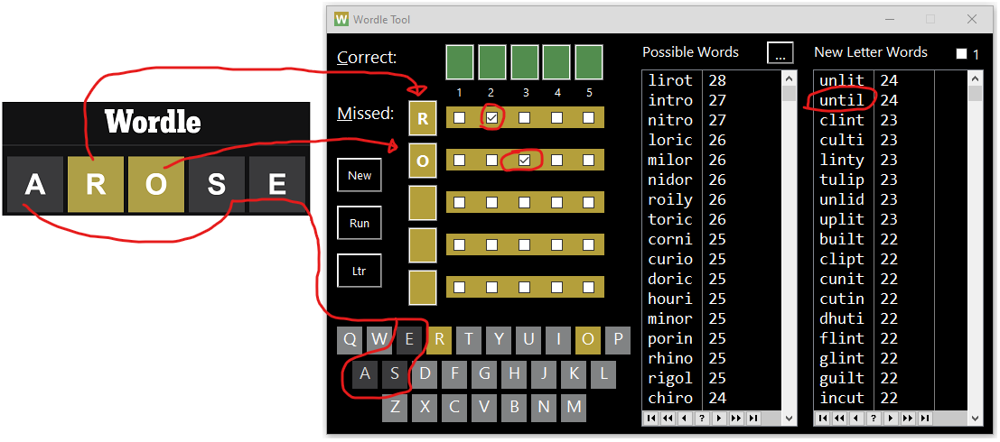

# Wordle

Wordle Game and Wordle Tool to help solve.

If you are not familiar with the 
[online Wordle game](https://www.nytimes.com/games/wordle)
 you can read about [Wordle on Wikipedia](https://en.wikipedia.org/wiki/Wordle).

## Wordle Tool

Mike Hanson created a Wordle Tool to help solve the puzzle by suggesting words. 
He presented it on [ClarionLive 565](https://www.youtube.com/watch?v=K4lThuFXeAw)
 and published his Wordle [CwProj on the BoxSoft GitHub](https://github.com/BoxSoft/Wordle).

In this Repo you will find my modified version of Mike's Wordle tool. 
I added a list of words with none of the letters currently guessed. 
I also changed the scoring and display the word score in the list. More details to come in this ReadMe . . .

To use this tool fill in the Correct Green letters in the Green boxes.
 Fill in the Yellow letters in the Yellow boxes then check the boxes for the positions 1-5 that missed.
 For any gray letters that are not in the word you must click them in the keyboard at the bottom of the window.

 
## Wordle Game

The online Wordle game only allows a single puzzle per day.
 That made it hard to work on the tool code so I created my own version of the Wordle game written in Clarion.
 Mike's tool code provided many of the elements I needed.

My game has a few differences from the online version:

 * Unhide the puzzle Secret Word
 * Override the Secret Word (unhide first). Allows repeating games or testing certain words and letters.
 * Guess nonsense non-dictionary words by clicking Ignore on warning message e.g. BYANY
 * No limit of 6 guesses
 * Undo a guess by selecting it then pressing the Delete key
 * [...] button shows list of suggested first words like: SOARE AROSE ARISE SLICE
